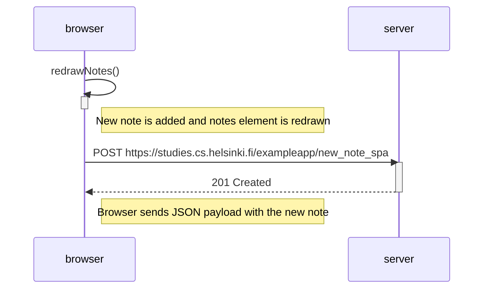

```mermaid
sequenceDiagram
participant browser
participant server

    browser->>browser: redrawNotes()
    activate browser
    deactivate browser
    Note right of browser: New note is added and notes element is redrawn

    browser->>server: POST https://studies.cs.helsinki.fi/exampleapp/new_note_spa
    activate server
    server-->>browser: 201 Created
    deactivate server
    
    Note right of browser: Browser sends JSON payload with the new note


```